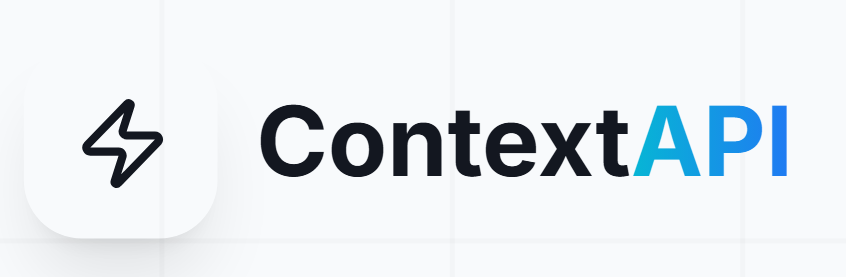

<p align="center">
  
</p>

<h1 align="center">🌐 Ultimate Context API</h1>

<p align="center">
  <strong>One API call. Complete context. Infinite possibilities.</strong>
</p>

<p align="center">
  <a href="https://www.npmjs.com/package/ultimate-context"></a>
  <a href="https://github.com/Chiragadve/Ultimate-context-API/blob/main/LICENSE"></a>
  <a href="https://ultimatecontextapi.vercel.app"></a>
  
</p>

<p align="center">
  <a href="#-features">Features</a> •
  <a href="#-quick-start">Quick Start</a> •
  <a href="#-api-response">API Response</a> •
  <a href="#-sdk">SDK</a> •
  <a href="#-demo">Demo</a> •
  <a href="https://ultimatecontextapi.vercel.app/docs">Docs</a>
</p>

---

## 🎯 The Problem We Solve

Building context-aware applications typically requires managing **5+ different API integrations**:

| Need | Traditional Approach | With Ultimate Context |
|------|---------------------|----------------------|
| Location | IP-API, MaxMind | ✅ Included |
| Weather | OpenWeather, Visual Crossing | ✅ Included |
| Currency | Frankfurter, ExchangeRate | ✅ Included |
| Holidays | Nager.Date, Calendarific | ✅ Included |
| Security | AbuseIPDB, IPQualityScore | ✅ Included |
| Device | UAParser | ✅ Included |

**Ultimate Context API** aggregates all of this into a **single, blazing-fast API call** with intelligent caching.

---

## ✨ Features

<table>
<tr>
<td align="center" width="33%">

### 🌍 IP Geolocation
City, Country, ISP, Timezone & Coordinates

</td>
<td align="center" width="33%">

### ☀️ Real-time Weather
Temperature, Conditions & Humidity

</td>
<td align="center" width="33%">

### 💰 Currency Rates
Live USD exchange rates for 150+ currencies

</td>
</tr>
<tr>
<td align="center">

### 🛡️ Security Analysis
TOR detection, Proxy check & Trust score

</td>
<td align="center">

### 📅 Public Holidays
Country-specific holiday calendar

</td>
<td align="center">

### 📱 Device Detection
Browser, OS & Device type

</td>
</tr>
</table>

---

## 🚀 Quick Start

### 1. Get Your API Key

Visit the [Dashboard](https://ultimatecontextapi.vercel.app/dashboard) to generate your free API key.

### 2. Make Your First Request

```bash
curl "https://ultimatecontextapi.vercel.app/v1/enrich?ip=8.8.8.8&key=YOUR_API_KEY"
```

### 3. That's It! 🎉

You now have complete context for any IP address in a single response.

---

## 📦 SDK Installation

Install our official TypeScript/JavaScript SDK for the best developer experience:

```bash
npm install ultimate-context
```

### Usage Example

```typescript
import { UltimateContext } from 'ultimate-context';

const client = new UltimateContext({
  apiKey: process.env.ULTIMATE_CONTEXT_API_KEY,
});

async function main() {
  const context = await client.enrich({ ip: '8.8.8.8' });
  
  console.log(`📍 Location: ${context.location.city}, ${context.location.country}`);
  console.log(`🌡️ Weather: ${context.context.weather.temp_c}°C`);
  console.log(`💵 Currency: ${context.context.currency.currencyCode}`);
  console.log(`🛡️ Trust Score: ${context.context.security.trust_rating}/100`);
}

main();
```

### Field Selection

Optimize your response by requesting only what you need:

```typescript
const response = await client.enrich({
  ip: '1.1.1.1',
  fields: ['location', 'context.weather']
});
```

---

## 📋 API Response

Here's what you get from a single API call:

```json
{
  "ip": "8.8.8.8",
  "location": {
    "city": "Mountain View",
    "country": "United States",
    "timezone": "America/Los_Angeles",
    "coordinates": { "lat": 37.386, "lon": -122.0838 },
    "isp": "Google LLC"
  },
  "context": {
    "weather": {
      "temp_c": 22.5,
      "condition": "Partly Cloudy",
      "humidity": 65,
      "icon": "partly-cloudy-day"
    },
    "currency": {
      "currencyCode": "USD",
      "rateUsd": 1.0
    },
    "holidays": {
      "upcoming": [
        { "name": "Independence Day", "date": "2026-07-04" }
      ]
    },
    "security": {
      "trust_rating": 100
    },
    "device": {
      "browser": "Chrome",
      "os": "Windows",
      "type": "desktop"
    }
  }
}
```

---

## 🏗️ Tech Stack & Architecture

<p align="center">
  
  
  
  
  
  
</p>

### Data Flow

```
┌──────────────┐     ┌─────────────────┐     ┌──────────────────┐
│   Client     │────▶│  Ultimate API   │────▶│   Redis Cache    │
│  (SDK/REST)  │     │   (Express)     │     │  (Shared Data)   │
└──────────────┘     └────────┬────────┘     └──────────────────┘
                              │
                              ▼
              ┌───────────────────────────────┐
              │     Parallel Data Fetching    │
              ├───────┬───────┬───────┬───────┤
              │IP-API │Weather│Currency│AbuseDB│
              └───────┴───────┴───────┴───────┘
```

**Performance Optimizations:**
- 🚀 **Shared Caching** - Weather, holidays, and currency data cached per city (1 hour TTL)
- ⚡ **Parallel Fetching** - All external APIs called simultaneously
- 📊 **Smart Rate Limiting** - Per-key limits with graceful degradation

---

## 🎥 Demo & Screenshots

### API Testing with Postman


---

### Website Preview

<details>
<summary>📸 Click to view website screenshots</summary>

#### Homepage


#### Documentation


#### Dashboard


</details>

---

## 🎯 Use Cases

<table>
<tr>
<td width="50%">

### 🛒 E-commerce
- Auto-detect customer's currency
- Adjust shipping for local holidays
- Personalize product recommendations by weather

</td>
<td width="50%">

### 🌐 Content Personalization
- "Good morning from [City]!" greetings
- Weather-based content suggestions
- Timezone-aware notifications

</td>
</tr>
<tr>
<td>

### 🔒 Cybersecurity
- Block traffic from high-risk IPs
- Detect TOR and proxy usage
- Implement geo-based access rules

</td>
<td>

### 📊 Analytics & Data
- Enrich logs with location data
- Understand user device distribution
- Regional traffic analysis

</td>
</tr>
</table>

---

## 📖 API Reference

### Endpoint

```
GET https://ultimate-context-api.vercel.app/v1/enrich
```

### Parameters

| Parameter | Type | Description |
|-----------|------|-------------|
| `ip` | string | IP address to enrich (optional, defaults to requester IP) |
| `key` | string | Your API key (**required**) |
| `fields` | string | Comma-separated fields to return (optional) |
| `debug` | boolean | Include debug information (optional) |

### Rate Limits

| Plan | Requests/Day | Caching |
|------|-------------|---------|
| Free | 100 | ✅ Shared |
| Pro | 10,000 | ✅ Priority |

### Response Headers

```
X-RateLimit-Limit: 100
X-RateLimit-Remaining: 99
X-RateLimit-Reset: 1704499200
```

---

## 🛠️ Local Development

```bash
# Clone the repository
git clone https://github.com/Chiragadve/Ultimate-context-API.git
cd Ultimate-context-API

# Install dependencies
npm install

# Set up environment variables
cp .env.example .env.local

# Run the frontend
npm run dev

# Run the backend (in a separate terminal)
cd backend_server
npm install
npm run dev
```

**Environment Variables:**
```env
# Supabase (Auth & Database)
NEXT_PUBLIC_SUPABASE_URL=your_supabase_url
NEXT_PUBLIC_SUPABASE_ANON_KEY=your_anon_key

# Redis (Caching)
REDIS_URL=your_redis_url

# External APIs
VISUAL_CROSSING_API_KEY=your_key
ABUSEIPDB_API_KEY=your_key
```

---

## 🤝 Contributing

Contributions are welcome! Please feel free to submit a Pull Request.

1. Fork the repository
2. Create your feature branch (`git checkout -b feature/AmazingFeature`)
3. Commit your changes (`git commit -m 'Add some AmazingFeature'`)
4. Push to the branch (`git push origin feature/AmazingFeature`)
5. Open a Pull Request

---

## 📄 License

This project is licensed under the MIT License - see the [LICENSE](LICENSE) file for details.

---

<p align="center">
  <strong>Built with ❤️ by <a href="https://github.com/Chiragadve">Chirag Adve</a></strong>
</p>

<p align="center">
  <a href="https://ultimatecontextapi.vercel.app">🌐 Live Demo</a> •
  <a href="https://ultimatecontextapi.vercel.app/docs">📚 Documentation</a> •
  <a href="https://www.npmjs.com/package/ultimate-context">📦 NPM Package</a>
</p>